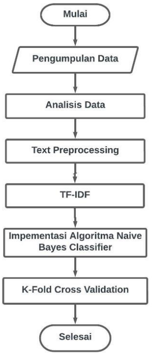

# TUGAS 2 METODOLOGI PENELITIAN

**Nama:** Muhammad Rafli Aulia Rojani Lutfi

**NPM:**  20081010061  

[[DAFTAR ISI]](../README.md)

## Soal

* Cari contoh Paper menggunakan metodelogi/metode
* Riset anda ingin menggunakan apa?
* Progress

## Pembahasan
1. contoh paper: [Analisis Sentimen Terhadap Program Kampus Merdeka Menggunakan Algoritma Naive Bayes ClassifierDi Twitter](https://ejurnal.teknokrat.ac.id/index.php/teknokompak/article/view/2061/1108)
2. menggunakan **metode penelitian**
3. Progress:
    
    

    **pengumpulan data**: Data opini yang digunakan berasal dari tweet dan komentar yang ada di media social Twitter.
    
    **analisis data**: Setelah pengumpulan data, dilakukan analisa data karena didapati data yang sama atau duplikasi data. Tujuan analisis data untuk menghindari terjadinya duplikasi data dan menghapus data yang tidak sesuai dengan kriteria yang dibutuhkan. di tahap ini juga dilakukan pe-labelan data

    **text-preprocessing**: Sebelum pengklasifikasian pada data tweet, dilakukan tahapan text preprocessing untuk mendapatkan data teks terstruktur seperti _case folding_, _tokenizing_, _stopword removal_, _stemming_, dll

    **TF-IDF**: TF-IDF merupakan perhitungan untuk mengukur seberapa penting kata (term) pada dokumen dan korpus. Proses ini dilakukan untuk menilai term atau bobot kata dari sebuah dokumen terhadap seluruh dokumen pada korpus.

    **implementasi naive bayes**: Tahap pengklasifikasian naïve bayes menggunakan jumlah kemunculan kata pada dataset dari setiap kelas

    **K-Fold Cross Validation**: mengetahui performa algoritma dengan percobaan klasifikasi sebanyak 5 kali dengan parameter yang sama sehingga mendapatkan hasil akurasi yang maksimal.

    

